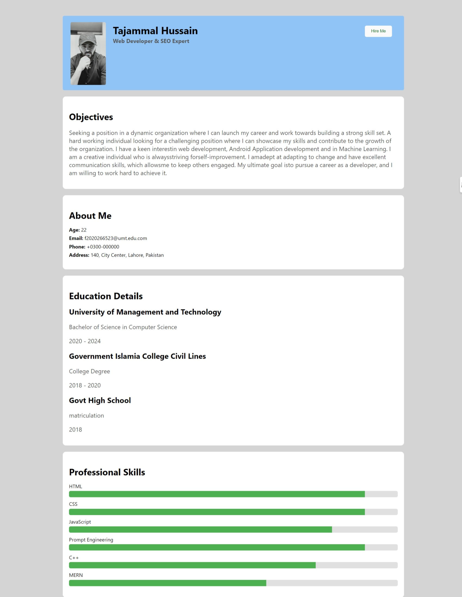

# CV

**See the screenshot at the end**


check the surge deployed version of this CV 
<a href="https://tajammalcv.surge.sh/" target="_blank">Here</a>

## Introduction
This is a CV website built using ReactJS. It showcases my professional skills, experience, education, and portfolio projects. The design is inspired by modern UI/UX principles to provide a clean and professional look.

## Table of Contents
- [Introduction](#introduction)
- [Features](#features)
- [Technologies Used](#technologies-used)
- [Setup and Installation](#setup-and-installation)
- [Usage](#usage)
- [Deployment](#deployment)
- [Screenshots](#screenshots)
- [Contributing](#contributing)
- [License](#license)
- [Contact](#contact)

## Features
- **Intro Section**: Includes a profile picture, name, title, and action buttons for downloading the CV and hiring.
- **About Me Section**: A brief introduction and personal details.
- **Professional Skills Section**: A list of professional skills with progress bars.
- **Objectives Section**: Personal career objectives.
- **Education Details Section**: Education history.
- **Experience Details Section**: Professional work experience.(can be added)
- **Portfolio Details Section**: Projects and portfolio details with links.(can be added)

## Technologies Used
- ReactJS
- CSS
- HTML
- Surge (for deployment)

## Setup and Installation
1. **Clone the repository**
    ```bash
    git clone https://github.com/tajammalhere/Assignment.CV.React.git
    cd your-repo-name
    ```

2. **Install dependencies**
    ```bash
    npm install
    ```

3. **Start the development server**
    ```bash
    npm start
    ```

4. **Open your browser** and navigate to `http://localhost:3000` to view the website.

## Usage
- **Customize Components**: Edit the components in the `src/components` directory to update content and styling.
- **Add Images**: Place your images in the `src/images` directory and update the import paths accordingly.
- **Deployment**: Follow the steps in the [Deployment](#) section to deploy your site using Surge.

## Deployment
1. **Build the project**
    ```bash
    npm run build
    ```

2. **Deploy to Surge**
    ```bash
    surge ./build your-unique-domain.surge.sh
    ```

## Screenshots



## Contributing
Contributions are welcome! Please open an issue or submit a pull request for any improvements or bug fixes.

## Contact
- **Email**: tajammalh705@gmail.com
